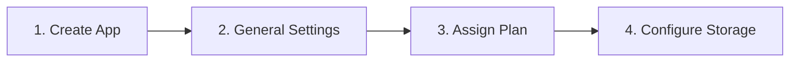

This page guides you through creating and configuring a **Tenant Application** within the TrueParser Developer Dashboard. 

<Note>
    **A Tenant Application is strictly required to access the TrueParser Parsing API.** It represents an isolated machine identity (client) under your organization. Once set up and assigned a subscription plan, its client credentials are used to obtain secure, 15-minute access tokens to communicate with the high-performance TrueParser Parsing API.
</Note>

---

## The Tenant Application Lifecycle

To get started, navigate to the **Applications** screen from the dashboard's sidebar menu. Here, you can view your active applications, their client IDs, and add new machine clients.

Configuring a new application follows a four-step lifecycle:

### Application Quotas & Limits

To ensure optimal platform performance, application quotas are enforced at the tenant level:

*   **Default Application Cap**: By default, each organization is limited to a **maximum of 3 active applications** within their tenant.
*   **Free Plan Limitation**: Out of your permitted applications, **only 1 application** can be assigned to the **Free Tier** plan ($0/Month). Any additional applications must be subscribed to paid tiers to process documents.
*   **Limit Increase Requests**: If your team requires more machine clients, you can open a support ticket from the dashboard to request a quota increase (subject to evaluation and approval).
*   **Enterprise Scaling**: If your infrastructure requires **more than 10 active applications**, please contact our sales team directly to transition to an **Enterprise Tier** account with custom limits and dedicated resources.

---

## 1. Create a Tenant Application

Click the **Add Application +** button in the top right corner of the Applications list to open the creation modal.

Initially, the modal displays the primary creation fields. Provide the following core parameters:

*   **Application Name**: Enter a formal display name for the application (under the `Name` field).
    <Note>
        Your application's display name represents your business or organization in formal verification contexts. It should be descriptive (e.g., `Acme Document Parser Production`) rather than a nickname or placeholder.
    </Note>
*   **License Region**: Select the geographical region for your application data from the dropdown. 
    <Tip>
        License regions are predefined with stable location codes linked to regional Turso database shards. Ensure you choose the region aligned with your data-locality requirements. You can view all available regions and their details in the **Locations** tab (see the [License Regions](/dashboard/license-regions) guide).
    </Tip>

### Reveal Advanced Settings (Scroll Down)

If you **scroll down within the creation modal**, several advanced options will be revealed:

*   **Status (Enabled / Disabled)**: Choose whether your new application is initialized in an active state (`Enabled`) or is temporarily turned off (`Disabled`) upon creation.
*   **Allowed Domains (1, 2, and 3)**: You can pre-configure your allowed domains directly inside the creation modal. These are the client application domains permitted to access the YJS/parsing backend (e.g., for browser-based CORS authentication).

Click **Create** to submit the form.

### Capture Your Credentials Safely

Upon successful creation, the dashboard will display a success toast presenting the one-time generated plaintext **Client Secret**.

<Warning>
    **Copy the Client Secret immediately and store it in a secure location (such as a corporate password manager).** 
    
    For security reasons, this plaintext secret is only shown once and cannot be retrieved later. If lost, you will have to regenerate the secret, which immediately invalidates the old credential.
</Warning>

---

## 2. General Settings (General Settings Tab)

After creating your application, click on its name in the Applications list to enter the detailed configuration view. The **General Settings** tab displays the core properties of your machine identity:

### Read-Only Identifiers
To prevent configuration drift and preserve transactional integrity, key parameters are locked upon creation:
*   **Application Display Name**: Represents your business in proof verification reports (fixed).
*   **Client ID**: The system-generated unique identifier used as the OAuth2 client identity (fixed).
*   **License Region**: The geographical boundary where your parsing shard and data reside (fixed).

### Secret Management
*   **Client Secret**: Masked by default. 
*   **Regenerate Secret**: If your secret is exposed or lost, click **Regenerate Secret**. This immediately invalidates the previous secret across the platform. Update all backend servers using the old credential with the new plaintext secret instantly to prevent service interruption.

### Allowed Domains (CORS Constraints)
You can optionally save up to **three allowed domains** on the application.
*   **Purpose**: These domains are injected into Cross-Origin Resource Sharing (CORS) headers allowed to use JSON Web Tokens (JWTs) issued by this application.
*   **Use Case**: Required if you are connecting to the TrueParser Parsing API directly from a browser-based, client-side application (e.g., an in-browser SPA).
*   **Domain Validation Rules**:
    *   `http://` and `https://` protocols are automatically stripped.
    *   Trailing slashes `/` are removed.
    *   Wildcards are rejected (e.g., `*.domain.com` is invalid).
    *   `localhost` is allowed (e.g., `localhost:3000`).

---

## 3. Assign a Subscription Plan (Plans Tab)

<Warning>
    **Plan assignment is strictly mandatory to process files.** 
    
    While your application can technically request tokens without a plan, those tokens will lack the required **plan entitlements and limits** claims. **The TrueParser Parsing API will strictly reject all document-parsing requests** unless an active subscription plan is assigned to the calling application.
</Warning>

Select the **Plans** tab to subscribe your application to a parsing tier:

### The Activation Paths

*   **Free Tier ($0/Month)**: 
    If you choose the Free tier, the dashboard **skips the payment gateway entirely**. The plan is instantly activated for your application, and you can immediately begin parsing documents.
*   **Paid Tiers**:
    Selecting a premium tier triggers a secure checkout flow. You will be prompted to add a credit card and complete the billing checkout before the plan entitlements are applied to your client credentials.

<Note>
    If an application is assigned a retired plan, token issuance is blocked. Ensure your applications are migrated to active, supported tiers.
</Note>

---

## 4. Configure S3 Storage (Storage Tab)

<Note>
    **Bringing your own S3-compatible storage is completely optional.** 
    
    If left unconfigured, the platform automatically uses its own secure, high-availability managed global storage to host your parsed files. Configure this tab only if your organization requires direct data custody or compliance constraints.
</Note>

Navigate to the **Storage** tab to configure custom storage:

<Warning>
    **Prerequisite**: You must create the bucket in your S3 provider's console and enable appropriate **Read and Write policies** for the provided access credentials before configuring this tab.
</Warning>

Provide the following parameters:

*   **Storage Provider**: Choose your provider from the dropdown. Supported platforms include:
    *   *Cloudflare R2, AWS S3, Tigris, MinIO, and Backblaze B2*.
*   **Access Key**: The S3 credential access key ID.
*   **Secret Key**: The S3 credential secret access key.
*   **Bucket Name**: The exact name of your target S3 bucket.
*   **Endpoint URL**: The service endpoint URL of your S3 provider.
*   **Region**: The region code (defaults to auto or `us-east-1` if left blank).

### Reverting to Managed Storage

If you wish to stop hosting files in your private bucket and return to platform-managed secure storage, click the **Delete Storage Provider** button. This will wipe your custom S3 credentials and safely fall back to the platform's global storage.

---

## Next Steps

Now that your application is created, activated with a plan, and optionally configured with custom storage, you are ready to authenticate and process documents:

*   **Token Authentication**: Learn how to use your Client ID and Client Secret to obtain a 15-minute bearer token in the [Authentication Guide](/dashboard/authentication).
*   **Interactive Testing**: Set up the pre-built parsing demo UI using your credentials in the [Demo UI Tutorial](/dashboard/demo-ui).
*   **Plan Quotas**: Track your monthly ingestion and document usage in the [Billing & Quotas](/dashboard/billing) reference.
